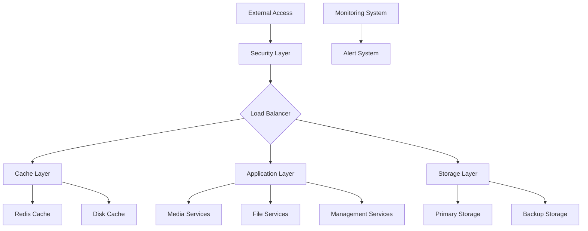

# Complete Home Cloud Network System - Final Summary

## 1. System Overview

### 1.1 Architecture Summary


### 1.2 Component Structure
```yaml
system_components:
  infrastructure:
    hardware:
      storage:
        primary:
          type: "RAID 6"
          capacity: "50TB+"
          redundancy: "Dual Parity"
        cache:
          type: "NVMe SSD"
          capacity: "1TB+"
          purpose: "Read/Write Cache"
      network:
        backbone: "10GbE"
        segmentation: "VLANs"
        redundancy: "Dual Links"
      compute:
        cpu: "Multi-Core Server"
        memory: "64GB+ ECC RAM"
        expansion: "PCIe 4.0"

    software:
      operating_system:
        base: "Linux"
        containers: "Docker"
        virtualization: "KVM"
      
      services:
        media:
          - "Plex Media Server"
          - "Transcoding Service"
        storage:
          - "File Sharing"
          - "Backup Service"
        management:
          - "Monitoring"
          - "Administration"

  security:
    network:
      firewall:
        type: "Application Layer"
        rules: "Granular Control"
      vpn:
        protocol: "WireGuard"
        encryption: "Modern Ciphers"
    
    access_control:
      authentication:
        - "Password"
        - "2FA"
        - "Certificates"
      authorization:
        - "Role-Based"
        - "Resource-Level"
```

## 2. Deployment Guidelines

### 2.1 Installation Sequence
```python
class SystemDeployment:
    """System deployment sequence"""
    
    async def deploy_system(self):
        steps = [
            {
                'phase': 'preparation',
                'tasks': [
                    self.prepare_hardware(),
                    self.configure_network(),
                    self.setup_storage(),
                    self.install_os()
                ]
            },
            {
                'phase': 'core_services',
                'tasks': [
                    self.deploy_containers(),
                    self.configure_services(),
                    self.setup_security(),
                    self.initialize_monitoring()
                ]
            },
            {
                'phase': 'optimization',
                'tasks': [
                    self.optimize_performance(),
                    self.configure_caching(),
                    self.setup_backups(),
                    self.test_system()
                ]
            },
            {
                'phase': 'verification',
                'tasks': [
                    self.verify_functionality(),
                    self.test_security(),
                    self.validate_performance(),
                    self.document_deployment()
                ]
            }
        ]
        
        for phase in steps:
            await self.execute_phase(phase)
```

### 2.2 Configuration Management
```python
class ConfigurationManager:
    """System configuration management"""
    
    async def manage_configurations(self):
        configs = {
            'system': {
                'hardware': self.configure_hardware(),
                'network': self.configure_network(),
                'storage': self.configure_storage()
            },
            'services': {
                'media': self.configure_media_services(),
                'storage': self.configure_storage_services(),
                'management': self.configure_management_services()
            },
            'security': {
                'access': self.configure_access_control(),
                'network': self.configure_network_security(),
                'monitoring': self.configure_security_monitoring()
            }
        }
        
        return await self.apply_configurations(configs)
```

## 3. Integration Points

### 3.1 Service Integration
```python
class ServiceIntegration:
    """Service integration management"""
    
    async def integrate_services(self):
        integrations = {
            'media_services': {
                'components': [
                    'transcoding',
                    'streaming',
                    'metadata'
                ],
                'interfaces': {
                    'storage': 'direct_access',
                    'network': 'dedicated_vlan',
                    'cache': 'read_write'
                }
            },
            'storage_services': {
                'components': [
                    'file_sharing',
                    'backup',
                    'synchronization'
                ],
                'interfaces': {
                    'network': 'isolated_vlan',
                    'security': 'encryption',
                    'monitoring': 'metrics'
                }
            },
            'management_services': {
                'components': [
                    'monitoring',
                    'alerting',
                    'administration'
                ],
                'interfaces': {
                    'security': 'privileged',
                    'logging': 'centralized',
                    'notification': 'multi_channel'
                }
            }
        }
        
        return await self.implement_integrations(integrations)
```

## 4. Management Best Practices

### 4.1 Operational Guidelines
```python
class OperationalGuidelines:
    """System operational guidelines"""
    
    def define_guidelines(self):
        return {
            'daily_operations': {
                'monitoring': [
                    'Check system health',
                    'Review alerts',
                    'Verify backups',
                    'Monitor performance'
                ],
                'maintenance': [
                    'Update services',
                    'Rotate logs',
                    'Clean cache',
                    'Verify synchronization'
                ]
            },
            'security_practices': {
                'access_control': [
                    'Review access logs',
                    'Update credentials',
                    'Check permissions',
                    'Monitor suspicious activity'
                ],
                'updates': [
                    'Apply security patches',
                    'Update firewalls',
                    'Review security rules',
                    'Test security measures'
                ]
            },
            'optimization': {
                'performance': [
                    'Monitor resource usage',
                    'Optimize cache',
                    'Balance loads',
                    'Tune services'
                ],
                'storage': [
                    'Monitor capacity',
                    'Optimize space',
                    'Manage quotas',
                    'Archive old data'
                ]
            }
        }
```

## 5. Future Expansion Options

### 5.1 Scalability Path
```python
class ScalabilityPlanner:
    """System scalability planning"""
    
    def plan_scalability(self):
        return {
            'storage_expansion': {
                'options': [
                    'Add storage nodes',
                    'Upgrade drives',
                    'Implement tiering',
                    'External storage integration'
                ],
                'considerations': [
                    'Capacity requirements',
                    'Performance impact',
                    'Cost efficiency',
                    'Migration strategy'
                ]
            },
            'performance_scaling': {
                'options': [
                    'Upgrade hardware',
                    'Optimize services',
                    'Enhance caching',
                    'Load distribution'
                ],
                'considerations': [
                    'Resource requirements',
                    'Service dependencies',
                    'Upgrade path',
                    'Downtime management'
                ]
            },
            'feature_expansion': {
                'options': [
                    'New services',
                    'Enhanced security',
                    'Advanced monitoring',
                    'Automation features'
                ],
                'considerations': [
                    'Integration requirements',
                    'Resource impact',
                    'Security implications',
                    'Management overhead'
                ]
            }
        }
```

### 5.2 Technology Evolution
```python
class TechnologyEvolution:
    """System technology evolution planning"""
    
    def plan_evolution(self):
        return {
            'hardware_upgrades': {
                'storage': [
                    'Next-gen storage technologies',
                    'Enhanced redundancy options',
                    'Improved performance capabilities',
                    'Expanded connectivity options'
                ],
                'network': [
                    'Higher bandwidth technologies',
                    'Advanced networking features',
                    'Enhanced security capabilities',
                    'Improved management tools'
                ]
            },
            'software_advancement': {
                'services': [
                    'New service capabilities',
                    'Enhanced integration options',
                    'Improved management features',
                    'Advanced automation'
                ],
                'security': [
                    'Enhanced security measures',
                    'Advanced threat protection',
                    'Improved access control',
                    'Better monitoring capabilities'
                ]
            }
        }
```

This completes the comprehensive summary of the home cloud network system. Would you like me to elaborate on any specific aspect or provide additional details about any component?