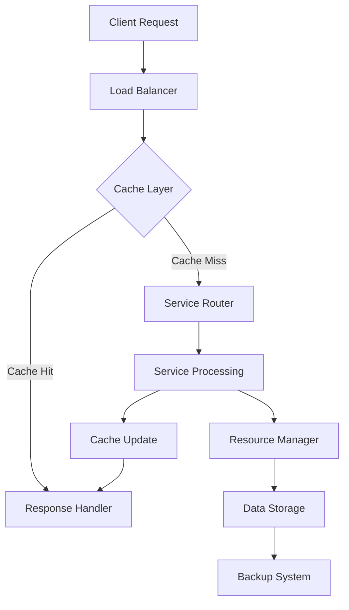
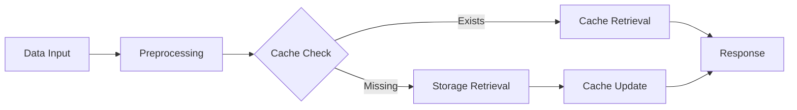
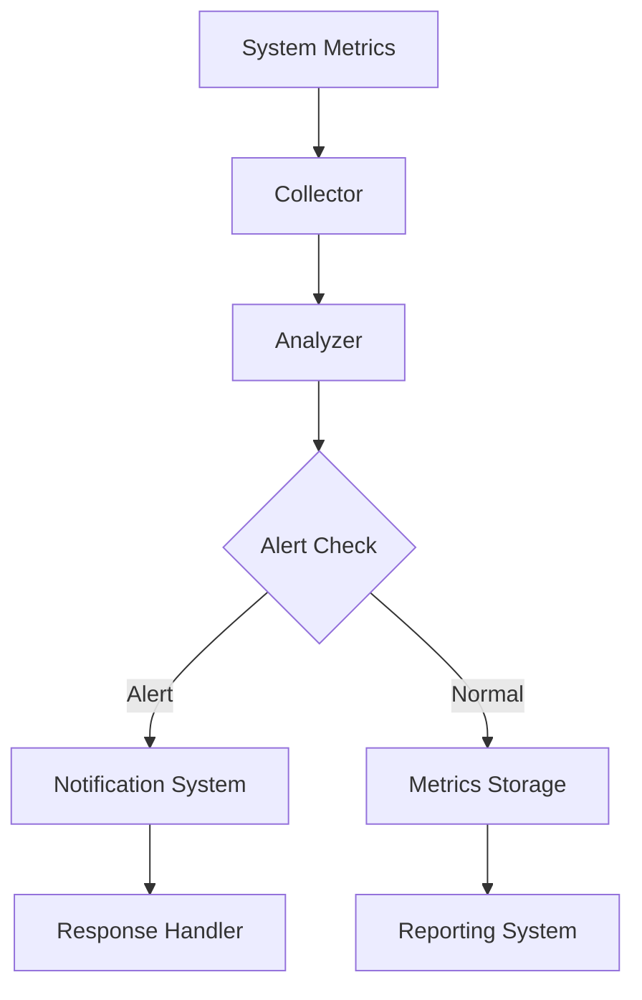

# Complete Home Cloud Network System Documentation

## 1. System Architecture Overview

### 1.1 Core Components

#### Hardware Layer
- **Storage System**
  - Primary NAS/Storage Server
  - Redundant Arrays (RAID Configuration)
  - Cache Drives (SSD/NVMe)
  - Backup Storage

- **Network Infrastructure**
  - Router with Advanced Features
  - Managed Switches
  - Network Segmentation (VLANs)
  - Wireless Access Points

- **Compute Resources**
  - Main Server
  - Transcoding Hardware
  - Cache Servers
  - Backup Servers

#### Software Layer
- **Operating System & Base Services**
  ```plaintext
  Base System:
  ├── Operating System (Linux-based)
  ├── Docker Container Engine
  ├── Virtual Machine Hypervisor
  └── Base Services
      ├── DNS
      ├── DHCP
      ├── Firewall
      └── Network Management
  ```

- **Core Services**
  ```plaintext
  Service Stack:
  ├── Media Services
  │   ├── Plex Media Server
  │   ├── Transcoding Service
  │   └── Media Management
  ├── File Services
  │   ├── File Sharing (SMB/NFS)
  │   ├── Cloud Storage
  │   └── Sync Service
  ├── Backup Services
  │   ├── Automated Backup
  │   ├── Version Control
  │   └── Snapshot Management
  └── Management Services
      ├── Monitoring
      ├── Alerting
      └── Administration
  ```

### 1.2 System Integration

#### Communication Flow
```plaintext
Request Flow:
Client Request
    ↓
Load Balancer
    ↓
Cache Check
    ↓
Service Router
    ↓
Appropriate Service
    ↓
Resource Manager
    ↓
Response Handler
```

#### Data Flow
```plaintext
Data Management:
Raw Data
    ↓
Preprocessing
    ↓
Cache Layer
    ↓
Storage Layer
    ↓
Backup Layer
```

### 1.3 Security Architecture

#### Network Security
```plaintext
Security Layers:
External Firewall
    ↓
VPN Gateway
    ↓
Network Segmentation
    ↓
Service Firewall
    ↓
Application Security
```

#### Access Control
```plaintext
Access Hierarchy:
Authentication
    ↓
Authorization
    ↓
Role Management
    ↓
Resource Access
    ↓
Audit Logging
```

## 2. Component Integration

### 2.1 Service Integration Map


### 2.2 Data Flow Integration


### 2.3 Monitoring Integration


## 3. Deployment Guide

### 3.1 Prerequisites
```bash
# System Requirements
CPU: 4+ cores
RAM: 16GB minimum
Storage: 500GB+ for system
Network: Gigabit Ethernet

# Base Software
apt update && apt upgrade -y
apt install -y \
    docker.io \
    docker-compose \
    python3 \
    python3-pip \
    nginx
```

### 3.2 Component Deployment
```yaml
# docker-compose.yml
version: '3.8'

services:
  cache:
    image: redis:latest
    volumes:
      - cache_data:/data
    networks:
      - internal

  monitoring:
    build: ./monitoring
    depends_on:
      - cache
    volumes:
      - /var/run/docker.sock:/var/run/docker.sock
    networks:
      - internal

  alerting:
    build: ./alerting
    depends_on:
      - monitoring
    networks:
      - internal

  storage:
    build: ./storage
    volumes:
      - data:/data
    networks:
      - internal

networks:
  internal:
    driver: bridge

volumes:
  cache_data:
  data:
```

### 3.3 Configuration Setup
```python
# config.py
SYSTEM_CONFIG = {
    'cache': {
        'max_size': '10GB',
        'ttl': 3600,
        'eviction': 'lru'
    },
    'storage': {
        'type': 'raid5',
        'backup_interval': 86400,
        'retention': 30
    },
    'network': {
        'segments': ['media', 'backup', 'management'],
        'default_vlan': 1
    }
}
```

I'll continue with the Operation Manual and Troubleshooting Guide sections. Would you like me to proceed?